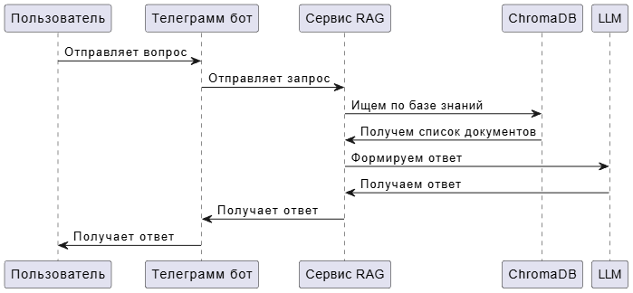

# Задание 7

## Проблемные места

Бот переодически выбирает некорректные источники для получения информации, зачастую попадают источники, которые напрямую не связаны с вопросом. Из-за этого в контекст попадает информация, которая является лишней и бот начинает на ее основе додумывать ответ. Например в случае с "Emo Redemption Arc" бот подбирает некорректные источники и додумывает контекст, а не отвечает прямым текстом, что что-то не так.

### Для устранения такой проблемы необходимо:

- Дополнить базу знаний необходимой информацией
- Поправить промпт, чтобы бот опирался только базу знаний
- Переработать данные, на которых происходит подготовка векторной базы данных
- Возомжно подобрать более подходящую модель для формирования чанков
- Также необходимо дополнить базу знаний контентом на разных языках, чтобы бот лучше понимал синонимы и контекст

Изначально для анализа контента использовалась модель `llama2`, но она переодически галюцинировала и всегда считала, что корректно выдает ответ относительно передаваемоей ей информации, поэтому в последствии она была заменена на `mistral:7b-instruct`, которая более точно следует промпту и более продуманно выдает ответ.

## Диаграмма последовательности

### Проблемные места

Проблемы могу происходить на моменте передачи вопроса от пользователя в сервис RAG. Пользователь может передавать некорректный или опасный запрос. Для устранения этого узкого места необходимо добавить предварительную валидацию вопроса и проверку его безопаности.
В случае если сервис не найдет информацию в векторной базе знаний, то LLM вернет отрицательный ответ, что ей не известна такая информация.